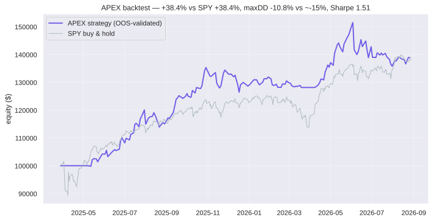

# APEX — Adaptive Pullback + Momentum Execution Agent

**lablab.ai × Alpaca — AI Trading Agents Hackathon** · Track: Options Alpha Agents

APEX is an autonomous, fully rule-based trading agent running 24/7 on Alpaca's
paper API. It combines a validated equity engine (momentum core + RSI(2)
pullback) with an options income overlay (cash-secured puts + covered calls —
the "wheel") driven by the same signals. Every decision is produced by explicit,
inspectable code shared verbatim between the backtester, the validation
harness, and the live agent. Nothing deploys unless it clears out-of-sample
gates.

## Judging-criteria map

| Criterion | Where it lives |
|---|---|
| **P&L Performance** | Live equity curve (`state/equity.csv`, `report.png`), trade ledger (`state/trades.csv`), backtest + OOS results below, [LIVE.md](LIVE.md) journal, [dashboard.html](dashboard.html) demo app |
| **Technology Implementation** | Dependency-free REST client w/ retries, official `alpaca-py` SDK reconciliation, official MCP server verification (`scripts/mcp_verify.py`), walk-forward harness, disk-cached data layer, idempotent agent loop, scheduled 2×/day via cron automation |
| **Creativity & Originality** | Signal-keyed options wheel; anti-overfitting research lab that *rejects* most strategies it tests; novel intraday-flow momentum signal (round 3) |
| **Presentation & Execution** | This README, `validation_report.md`, `backtest_equity.svg`, `deck/` slide deck, `WRITEUP.md`, `dashboard.html` |

## Strategy

Universe: 18 liquid names (SPY QQQ XLK XLF XLE XLV XLY XLI NVDA AAPL MSFT AMZN
GOOGL META AMD AVGO JPM TSLA), long-only equities + short options premium.

**Regime filter:** SPY close > 200-day SMA → risk-on. Risk-off blocks entries
and rotates the core sleeve to cash.

**Equity engine**
- *Core sleeve (≤3):* hold top-3 by momentum score (intraday-flow ranking,
  round-3 winner: `0.5×close-close score + 0.5×Σ log(close/open)` over 63d),
  positive scores only; rotate on rank loss or regime flip.
- *Pullback sleeve (≤3):* eligible = score > 0 and top-8; enter when RSI(2) ≤ 10;
  exit at RSI(2) ≥ 70, momentum decay, or trailing stop.

**Options overlay (wheel)**
- Pullback signal → **sell 1 cash-secured put** (~Δ30, 21–45 DTE, liquidity
  filtered: bid ≥ $0.30, spread ≤ 25%, hard Δ band) instead of buying shares.
  Assignment is welcome — shares are adopted by the equity engine.
- Stock positions ≥ 100 shares → **sell covered calls** (1 per name, ~Δ30).
- All short premium has a resting GTC **buy-back at 50% of credit**.

**Risk engine:** 1% equity risk per trade vs a 2×ATR stop; 20% per-name cap;
≤6 equity positions; ≤3 short options; CSP secured ≤ 50% equity; 2.5×ATR
trailing stops checked daily **and intraday**; −2.5% daily kill switch.

## Anti-overfitting (validation before deployment)

`validate.py` runs three defenses — full results in [`validation_report.md`](validation_report.md):

1. **Walk-forward OOS** — 3 unseen windows (2025-H1, 2025-H2, 2026 YTD), params fixed a priori.
2. **Sensitivity plateau** — 18 single-parameter perturbations of the champion.
3. **Deployment gates** — OOS Sharpe ≥ 0.5, every fold positive, IS→OOS degradation < 50%, maxDD < 20%, ≥15 trades.

| variant | IS Sharpe | OOS Sharpe | verdict |
|---|---|---|---|
| **apex_hybrid** (deployed) | 0.26 | **1.11** | ✅ DEPLOY — all gates pass |
| **etf_rotation** (alternate) | 0.39 | **1.10** | ✅ DEPLOY-able |
| fast_momentum | 0.20 | 1.08 | ✅ DEPLOY-able |
| conservative | 0.15 | 1.04 | ✅ DEPLOY-able |
| tight_stops | 0.47 | 0.88 | ✅ DEPLOY-able |
| core_momentum | 0.73 | 0.74 | ❌ REJECT (negative fold) |
| tilted_pullback | −0.07 | 0.60 | ❌ REJECT (negative fold) |
| pure_rsi2 (no mom filter) | −0.24 | 0.34 | ❌ REJECT |
| pullback_only | 0.21 | 0.09 | ❌ REJECT |

Champion sensitivity: **all 18 perturbations stay profitable** (Sharpe 0.51–0.93)
— a plateau, not a curve-fit spike. Research finding: the momentum filter is
what makes RSI(2) pullbacks work — pure reversion (pure_rsi2) fails the gates.

### Round 3 — novel-alpha hypotheses (original research)

Four original signal hypotheses, ablated on top of the base engine and put
through the same pre-registered gates:

| hypothesis | idea | OOS Sharpe | verdict |
|---|---|---|---|
| **flow_momentum** | rank by intraday-flow momentum (Σ log close/open) — institutional accumulation shows up intraday; gap-driven moves carry reversal risk | **1.20** | ✅ **DEPLOYED as the live ranking** |
| rho_gate | pullback entries only when lag-1 autocorr(20d) < 0 (provably mean-reverting microstructure) | 0.83 | ❌ REJECT (neg. fold) |
| persist_gate | entries only when sign-change z-score(40d) > 0 (anti-persistent vs random-walk null) | 0.84 | ❌ REJECT (neg. fold) |
| vov_gate | entries only when vol-of-vol percentile(1y) > 2/3 (panic overshoots bounce harder) | 0.79 | ❌ REJECT (neg. fold) |

`flow_momentum` beat the base champion out-of-sample (1.20 vs 1.11), then
passed **its own** 18-perturbation sensitivity plateau (worst-case Sharpe 0.49,
full-period +36.5% / Sharpe 0.98 vs base +32.5% / 0.86) before being promoted.
*Honest caveat:* 13 variants were tested, so multiple-comparison risk exists —
the live paper ledger is the final arbiter. The three rejected gates remain in
`strategy.py` as documented negative results. Revert with
`APEX_FLOW_MOMENTUM=false`.

### Round 4 — ranking hypotheses (lesson applied: rankings > gates)

| hypothesis | idea | IS → OOS Sharpe | verdict |
|---|---|---|---|
| accel | momentum + acceleration (2nd derivative boost) | 0.98 → **0.34** | ❌ REJECT — textbook overfit: in-sample star, OOS collapse |
| riskadj | vol-normalized momentum (smooth trenders) | 0.42 → 1.11 | ❌ REJECT — best single fold of the round (Sharpe 2.70) but a negative 2025-H1 fold disqualifies it |
| gappen | gap-share penalty: `score × (1 − overnight\|move\| share)` | −0.12 → **1.02** | ✅ DEPLOY-able alternate (does not dethrone flow's 1.20) |

Total across 4 rounds: **16 variants tested, 6 cleared, 10 rejected.** The live
ranking remains `flow` (`APEX_RANK_MODE=accel|riskadj|gappen|classic` to
switch). accel is the showcase negative result — the gates caught a parameter
spike that in-sample-only testing would have shipped.

**Backtest, champion config (2024-06 → 2026-08, next-open fills, 5 bps slippage):**
+38.4% total return, Sharpe 1.51, Sortino 2.09, maxDD −10.8%, 250 trades,
53% win rate, profit factor 1.60 — matching SPY's return with ~2/3 of the
drawdown. Equity curve:



*Honest caveats:* the sample window is bull-leaning (the 2022-style bear leg is
out of sample); the options overlay inherits pullback-signal timing whose
standalone equity form was rejected by the gates — the premium-selling form has
different expectancy, and its live fills are tracked in the research log;
options logic is validated by unit-level dry-runs and live paper fills, not by
historical option-chain backtests (no free historical chains).

## Architecture

```
config.py           all parameters (secrets via .env, never committed)
alpaca_client.py    dependency-free REST wrapper (trading + data, retries)
strategy.py         indicators & rules — pure functions (backtest == live)
risk.py             ATR sizing, trailing stops, guards, kill switch
options_overlay.py  CSP + covered-call selection, profit-take management
reconcile.py        independent position check via official alpaca-py SDK
cache.py            disk cache for daily bars (fast research loops)
backtest.py         event-driven backtester -> stats + equity chart
validate.py         walk-forward + sensitivity + deployment gates
agent.py            live agent: one idempotent cycle per invocation
report.py           live P&L report + chart
journal.py          LIVE.md trading journal generator
dashboard.py        single-file demo app (dashboard.html) regenerator
scripts/mcp_verify.py  official MCP server end-to-end verification
deck/               slide deck source (pptd)
state/              runtime state/logs (gitignored)
```

**Live loop (each cycle):** clock/account/positions sync → fetch ~400d bars →
regime + ranks + RSI(2)/ATR on the latest completed bar → exits first
(intraday stops every run) → core entries → pullback entries as **CSPs when a
liquid contract exists, stock otherwise** → covered calls → profit-take orders
verified → equity snapshot + full decision log + journal + dashboard refresh.
Idempotent per bar; no-ops when the market is closed. Scheduled by a cron
automation at **09:47 and 15:47 America/New_York, Mon–Fri**.

## Running it

```bash
cp .env.example .env   # add paper keys
python agent.py --status     # account/positions snapshot
python agent.py --dry-run    # intended actions incl. option contracts
python agent.py              # one live cycle
python backtest.py           # reproduce backtest + chart
python validate.py           # re-run anti-overfitting harness
python report.py             # live P&L report
python dashboard.py          # regenerate the demo app
python scripts/mcp_verify.py # verify via official MCP server
```

## Alpaca MCP server

The official `alpaca-mcp-server` (v3.4.7, 72 tools) is wired in and verified
end-to-end: `python scripts/mcp_verify.py` spawns the server over stdio and
pulls account + positions through the MCP path — see `docs/mcp_verification.txt`.
To drive the account conversationally, add to your MCP client config:

```json
{ "mcpServers": { "alpaca": { "command": "alpaca-mcp-server",
  "env": { "ALPACA_API_KEY": "...", "ALPACA_SECRET_KEY": "..." } } } }
```

## Roadmap

- Deploy `etf_rotation` as a second validated sleeve on a separate sub-ledger
- Short-side momentum (shorting enabled on the account)
- Walk-forward *re-fitting* schedule (currently params are frozen a priori)

*Paper trading only. Not investment advice.*
